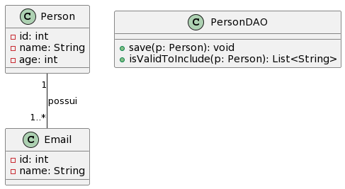

# person-validator

Exercício 2 - Considerando o conjunto de classes abaixo. Utilizando um a técnica de TDD, implemente o método isValidToInclude(). Esse método deve retornar uma lista de erros com base no objeto Person passado como parâmetro. Deve ser validado:

- O nome é composto por ao menos 2 partes e deve ser composto de letras
- A idade deve estar no intervalo [1, 200]
- O objeto Person deve ter pelo menos um objeto da classe Email associado
- O nome da classe Email deve estar no formato "_____@____._____", sendo que cada parte deve ter ao menos um caractere

